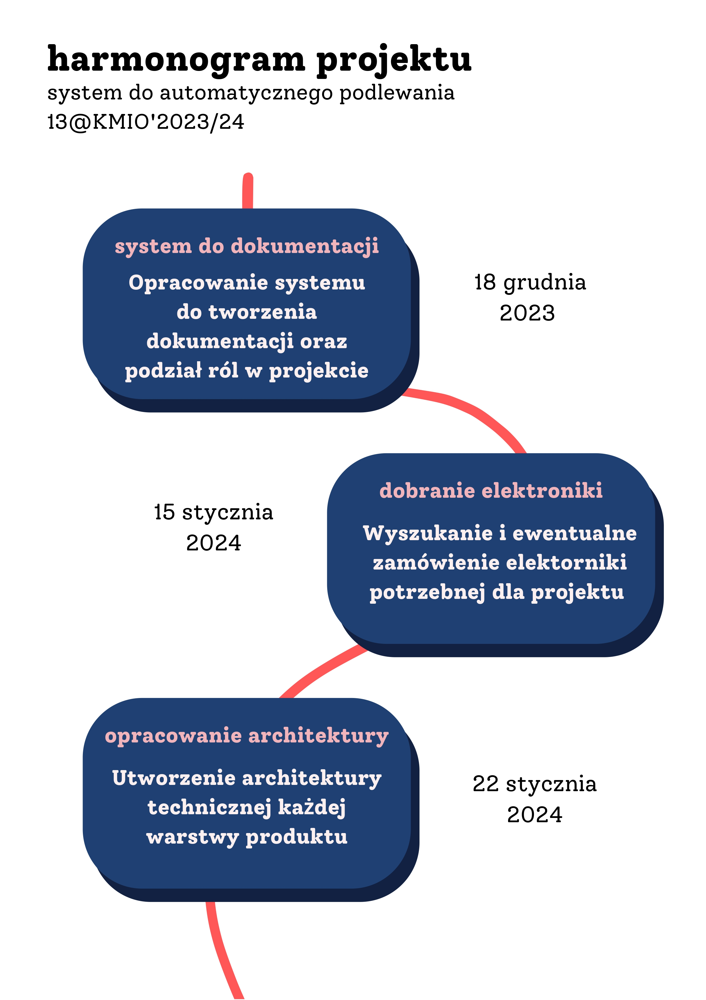
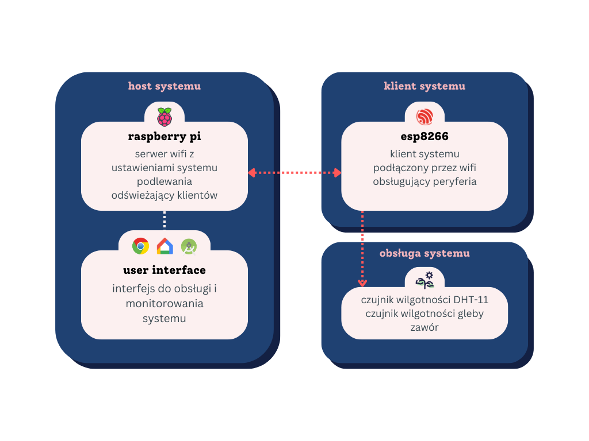

# Dokumentacja projektu grupowego

[System do automatycznego podlewania](https://projektgrupowy.eti.pg.edu.pl/editions/3/projects/418)

## Skład grupy

| Imię     | Nazwisko   | nr Indeksu |
| -------- | ---------- | ---------- |
| Camille  | Nadir      | 188779     |
| Dawid    | Mielewczyk | 189637     |
| Michał   | Pryba      | 184637     |
| Olaf     | Łogin      | 184090     |
| Wojciech | Szamocki   | 188909     |

### Harmonogram

### Architektura systemu podlewania

